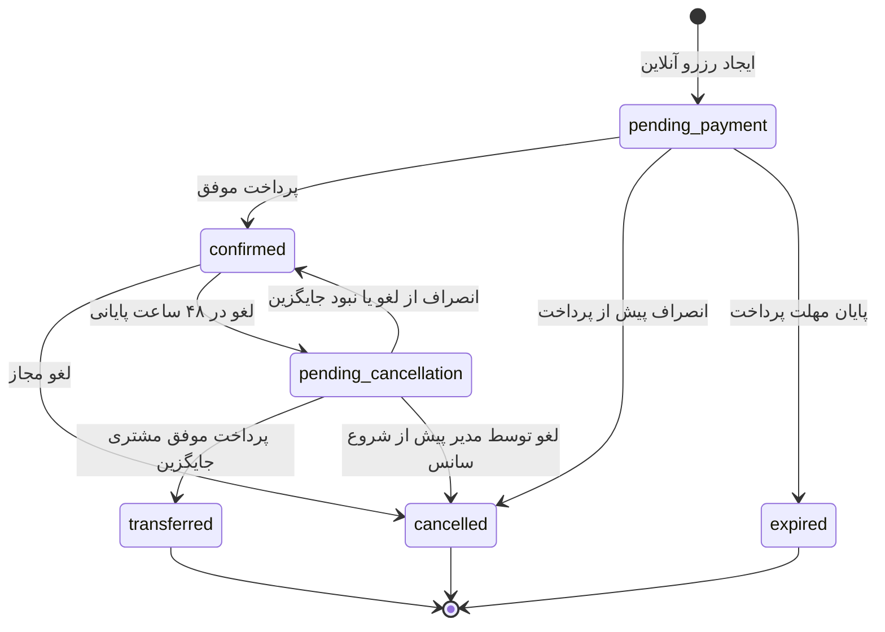
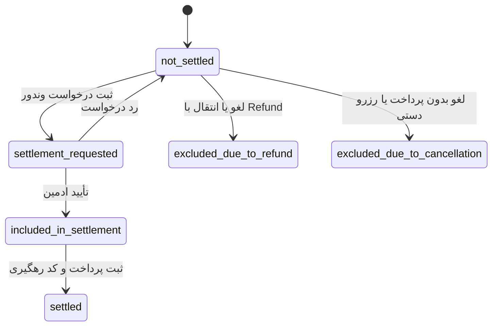

# راهنمای جامع چرخه رزرو، پرداخت، لغو و تسویه

این سند رفتار فعلی سیستم رزرو توپ‌ست را بر اساس پیاده‌سازی موجود توضیح می‌دهد.
هدف آن این است که تیم محصول، ادمین، توسعه‌دهنده و پشتیبانی برداشت یکسانی از وضعیت
هر رزرو، آثار مالی آن و ایرادهای شناخته‌شده داشته باشند.

> تاریخ بازبینی: ۱۴۰۵/۰۵/۱۲
> محدوده: `Booking`، `TimeSlot`، `Payment`، `Refund`، جایگزینی و تسویه وندور

## ۱. تصویر کلی دامنه

یک «رزرو» فقط یک وضعیت ندارد. برای فهم وضعیت واقعی آن باید حداقل این داده‌ها کنار
هم بررسی شوند:

```text
Booking.status
Booking.source
Booking.settlement_status
Payment.status
TimeSlot.start_time / TimeSlot.end_time
```

موجودیت‌های اصلی و ارتباط آن‌ها:

```text
User ──< Booking >── TimeSlot >── Vendor
             │
             ├──< Payment
             ├──< Refund
             ├──< Penalty
             ├── SettlementItem >── Settlement
             └── ReplacementRequest / BookingHold
```

- `Booking` مالکیت و وضعیت عملیاتی رزرو را نگه می‌دارد.
- `TimeSlot` زمان، قیمت پایه و وضعیت اشغال سانس را نگه می‌دارد.
- `Payment` تلاش‌ها و نتیجه پرداخت درگاه را نگه می‌دارد.
- `Refund` بازپرداخت پول مشتری را نگه می‌دارد.
- `Penalty` جریمه لغو را نگه می‌دارد.
- `Settlement` درخواست پرداخت سهم وندور را نگه می‌دارد.

منبع اصلی مدل رزرو: [`backend/app/models/booking.py`](../backend/app/models/booking.py)

## ۲. فیلدهای Booking

### ۲.۱. شناسه‌ها و ارتباطات

| فیلد                    | نوع مفهومی | کاربرد                                   |
| ----------------------- | ---------- | ---------------------------------------- |
| `id`                    | عدد        | شناسه یکتای رزرو                         |
| `user_id`               | FK         | کاربری که رزرو به نام اوست               |
| `slot_id`               | FK         | سانس مربوط به رزرو                       |
| `replaces_booking_id`   | FK اختیاری | رزرو قبلی که این رزرو جایگزین آن شده است |
| `created_by_manager_id` | FK اختیاری | مدیر ایجادکننده رزرو دستی                |

`replaces_booking_id` به معنای تغییر مالک رکورد قبلی نیست. در جایگزینی، رکورد قبلی
`transferred` می‌شود و یک Booking جدید برای مشتری جایگزین ساخته می‌شود.

### ۲.۲. وضعیت‌ها

| فیلد                | مقادیر اصلی                                                                                   | کاربرد                        |
| ------------------- | --------------------------------------------------------------------------------------------- | ----------------------------- |
| `status`            | `pending_payment`, `confirmed`, `pending_cancellation`, `transferred`, `cancelled`, `expired` | وضعیت عملیاتی رزرو            |
| `source`            | `online`, `manager_manual`                                                                    | منبع ایجاد رزرو               |
| `settlement_status` | وضعیت‌های تسویه                                                                               | وضعیت مالی رزرو نسبت به وندور |

`status` و `settlement_status` مستقل‌اند. برای مثال یک رزرو می‌تواند هم‌زمان:

```json
{
  "status": "confirmed",
  "settlement_status": "settlement_requested"
}
```

باشد؛ یعنی رزرو از نظر عملیاتی قطعی و از نظر مالی داخل درخواست تسویه است.

### ۲.۳. اطلاعات مشتری

| فیلد                 | کاربرد                   |
| -------------------- | ------------------------ |
| `customer_full_name` | نام مشتری در رزرو دستی   |
| `customer_phone`     | شماره مشتری در رزرو دستی |

در رزرو آنلاین، اطلاعات اصلی مشتری از رابطه `Booking.user` خوانده می‌شود. در رزرو
دستی، مدیر ممکن است اطلاعات شخصی را در همین دو فیلد ثبت کند.

### ۲.۴. اطلاعات مالی

| فیلد             | کاربرد                                     |
| ---------------- | ------------------------------------------ |
| `price_paid`     | مبلغ کل رزرو؛ قیمت سانس به‌علاوه هزینه توپ |
| `slot_price`     | snapshot قیمت سانس هنگام رزرو              |
| `ball_price`     | snapshot هزینه توپ هنگام رزرو              |
| `with_ball`      | آیا توپ انتخاب شده است                     |
| `penalty_amount` | جریمه نهایی‌شده لغو، در صورت وجود          |

رابطه مورد انتظار مبالغ:

```text
price_paid = slot_price + ball_price
```

وجود مقدار در `price_paid` به‌تنهایی اثبات نمی‌کند پول دریافت شده است. پرداخت واقعی
باید از وجود `Payment.status = success` احراز شود.

### ۲.۵. سایر فیلدها

| فیلد         | کاربرد                        |
| ------------ | ----------------------------- |
| `created_at` | زمان ایجاد رزرو               |
| `updated_at` | زمان آخرین تغییر              |
| `expires_at` | پایان مهلت پرداخت رزرو آنلاین |

## ۳. چرخه وضعیت عملیاتی رزرو



رزرو دستی مستقیماً با وضعیت `confirmed` ساخته می‌شود و مرحله پرداخت آنلاین ندارد.

### ۳.۱. `pending_payment`

رزرو آنلاین ایجاد شده ولی پرداخت نهایی نشده است.

```json
{
  "status": "pending_payment",
  "source": "online",
  "settlement_status": "not_settled",
  "expires_at": "حدود ۱۰ دقیقه بعد از ایجاد"
}
```

رفتار مورد انتظار:

- سانس موقتاً `reserving` و رزروشده می‌شود.
- تنها صاحب رزرو اجازه پرداخت دارد.
- پرداخت موفق، Booking را `confirmed` می‌کند.
- اتمام مهلت، Booking را `expired` و سانس را آزاد می‌کند.
- لغو پیش از پرداخت، Booking را `cancelled` می‌کند و Refund ندارد.
- این وضعیت هرگز قابل تسویه با وندور نیست.

### ۳.۲. `confirmed`

رزرو قطعی و فعال است.

#### رزرو آنلاین

```json
{
  "status": "confirmed",
  "source": "online",
  "settlement_status": "not_settled"
}
```

رزرو آنلاین قطعی در حالت سالم باید یک Payment موفق داشته باشد. پیش از پایان سانس
قابل تسویه نیست و پس از پایان سانس، در صورت برقرار بودن سایر شروط، قابل تسویه می‌شود.

#### رزرو دستی مدیر

```json
{
  "status": "confirmed",
  "source": "manager_manual",
  "settlement_status": "excluded_due_to_cancellation",
  "created_by_manager_id": 42,
  "price_paid": 0
}
```

رزرو دستی پرداخت آنلاین ندارد و وارد تسویه سایت با وندور نمی‌شود. سیستم فعلی مبلغ
پرداخت حضوری را ثبت نمی‌کند.

### ۳.۳. `pending_cancellation`

اگر مشتری در بازه ۴۸ ساعت پایانی درخواست لغو دهد، رزرو بلافاصله لغو و Refund نمی‌شود؛
بلکه وارد فرایند یافتن جایگزین می‌شود.

```json
{
  "status": "pending_cancellation",
  "source": "online",
  "settlement_status": "not_settled",
  "penalty_amount": null
}
```

- مالکیت رزرو هنوز متعلق به مشتری قبلی است.
- سانس آزاد نیست.
- Refund قطعی هنوز ساخته نشده است.
- این رزرو قابل تسویه نیست.
- مشتری می‌تواند درخواست لغو باز را پس بگیرد.
- اگر جایگزین پیدا نشود، رزرو دوباره `confirmed` می‌شود.

### ۳.۴. `transferred`

با پرداخت موفق مشتری جایگزین:

- Booking قبلی `transferred` می‌شود.
- Booking قبلی از تسویه خارج می‌شود.
- جریمه و Refund مشتری قبلی ثبت می‌شود.
- Booking جدید با `replaces_booking_id` ساخته می‌شود.
- Booking جدید `confirmed` و بعد از پایان سانس قابل تسویه است.

رکورد قبلی:

```json
{
  "status": "transferred",
  "settlement_status": "excluded_due_to_refund",
  "penalty_amount": 50000
}
```

رکورد جدید:

```json
{
  "status": "confirmed",
  "source": "online",
  "settlement_status": "not_settled",
  "replaces_booking_id": 123
}
```

### ۳.۵. `cancelled`

رزرو دیگر فعال نیست. آثار مالی آن به علت و زمان لغو وابسته است.

#### لغو رزرو پرداخت‌نشده

```json
{
  "status": "cancelled",
  "settlement_status": "excluded_due_to_cancellation",
  "penalty_amount": null
}
```

Refund ندارد، چون پرداخت موفقی وجود نداشته است.

#### لغو زودهنگام توسط مشتری

در لغو بیش از ۴۸ ساعت مانده به شروع سانس:

```text
penalty_amount = price_paid × ۱۰٪
refund_amount = price_paid - penalty_amount
```

Booking به `cancelled / excluded_due_to_refund` می‌رود و Refund جداگانه ساخته می‌شود.

#### لغو توسط مدیر مجموعه

لغو مدیر برای رزرو آنلاین پرداخت‌شده:

- فقط پیش از شروع سانس مجاز است.
- کل `price_paid` برای Refund ثبت می‌شود.
- مشتری جریمه نمی‌شود.
- هزینه مالی لغو بر عهده سایت ثبت می‌شود.
- Booking از تسویه وندور خارج می‌شود.

### ۳.۶. `expired`

مهلت پرداخت رزرو تمام شده است.

```json
{
  "status": "expired",
  "source": "online",
  "settlement_status": "excluded_due_to_cancellation"
}
```

- سانس آزاد می‌شود.
- Refund ساخته نمی‌شود.
- رزرو قابل پرداخت، لغو یا تسویه نیست.

## ۴. چرخه وضعیت تسویه Booking

مقادیر `settlement_status`:

| وضعیت                          | معنی                                             |
| ------------------------------ | ------------------------------------------------ |
| `not_settled`                  | هنوز وارد درخواست تسویه نشده است                 |
| `settlement_requested`         | داخل درخواست تسویه pending قرار دارد             |
| `included_in_settlement`       | درخواست توسط ادمین تأیید شده ولی پرداخت نشده است |
| `settled`                      | تسویه به‌عنوان پرداخت‌شده ثبت شده است            |
| `excluded_due_to_refund`       | به علت Refund یا انتقال از تسویه خارج است        |
| `excluded_due_to_cancellation` | بدون بدهی قابل تسویه از چرخه خارج است            |

چرخه عادی:



## ۵. شروط دقیق قابل تسویه بودن یک رزرو

تمام شروط زیر باید هم‌زمان برقرار باشند:

```text
Booking.source == online
Booking.status == confirmed
Booking.settlement_status == not_settled
Payment.status == success
TimeSlot.end_time <= now
TimeSlot.vendor_id == vendor مورد درخواست
```

اگر بازه تسویه ارسال شود، بازه روی `TimeSlot.end_time` اعمال می‌شود؛ بنابراین معنای
آن دقیقاً «سانس‌های پایان‌یافته در این بازه» است.

رزروهای زیر قابل تسویه نیستند:

- رزرو دستی مدیر؛
- رزرو منتظر پرداخت؛
- رزرو بدون Payment موفق؛
- رزرو منقضی، لغوشده یا منتقل‌شده؛
- رزرو منتظر جایگزین؛
- سانسی که هنوز پایان نیافته است؛
- رزروی که در درخواست تسویه دیگری قرار دارد؛
- رزروی که قبلاً تسویه شده است؛
- رزروی که به علت Refund از تسویه خارج شده است.

## ۶. جدول ترکیب‌های مهم و معتبر

| `status`               | `source`         | `settlement_status`            | تفسیر                              |
| ---------------------- | ---------------- | ------------------------------ | ---------------------------------- |
| `pending_payment`      | `online`         | `not_settled`                  | منتظر پرداخت                       |
| `confirmed`            | `online`         | `not_settled`                  | قطعی؛ بعد از پایان سانس قابل تسویه |
| `confirmed`            | `online`         | `settlement_requested`         | درخواست تسویه ثبت شده              |
| `confirmed`            | `online`         | `included_in_settlement`       | تأییدشده و منتظر پرداخت وندور      |
| `confirmed`            | `online`         | `settled`                      | رزرو برگزار و تسویه شده            |
| `confirmed`            | `manager_manual` | `excluded_due_to_cancellation` | رزرو دستی و خارج از تسویه          |
| `pending_cancellation` | `online`         | `not_settled`                  | منتظر مشتری جایگزین                |
| `transferred`          | `online`         | `excluded_due_to_refund`       | رزرو مشتری قبلی منتقل شده است      |
| `cancelled`            | `online`         | `excluded_due_to_refund`       | لغو همراه با بازپرداخت             |
| `cancelled`            | `online`         | `excluded_due_to_cancellation` | لغو بدون پرداخت موفق               |
| `expired`              | `online`         | `excluded_due_to_cancellation` | پایان مهلت پرداخت                  |

## ۷. قواعد و invariantهای حیاتی

این قواعد باید در بک‌اند تضمین شوند و UI فقط بازتاب آن‌ها باشد:

۱. برای هر سانس حداکثر یک Booking فعال مجاز است. وضعیت‌های فعال عبارت‌اند از:
`pending_payment`، `confirmed` و `pending_cancellation`.

۲. هر کاربر حداکثر یک Booking با وضعیت `pending_payment` می‌تواند داشته باشد.

۳. برای هر Booking حداکثر یک Payment موفق مجاز است.

۴. سانسی که شروع شده یا گذشته است، نه توسط کاربر و نه توسط مدیر قابل لغو نیست.

۵. مبلغ پرداخت موفق باید با مبلغ مورد انتظار Booking تطابق داشته باشد.

۶. Booking فاقد Payment موفق نباید وارد تسویه شود.

۷. Booking لغوشده، منتقل‌شده یا Refundشده نباید به `settled` برسد.

۸. تغییر Booking، Refund و Settlement مرتبط باید اتمیک و در یک تراکنش باشد.

۹. وضعیت `paid` باید نهایی و غیرقابل بازگشت باشد؛ اصلاح آن باید از مسیر عملیات مالی
جبرانی و auditشده انجام شود.

## ۸. باگ‌ها و شکاف‌های شناخته‌شده

### ۸.۱. رفع‌شده: درخواست مجدد پس از رد تسویه

**وضعیت:** رفع‌شده در ۱۴۰۵/۰۵/۱۳
**بخش:** `SettlementItem`

محدودیت یکتایی دائمی `SettlementItem.booking_id` حذف شده است. رد درخواست Booking را
به `not_settled` برمی‌گرداند و درخواست بعدی آیتم تاریخی جدیدی می‌سازد؛ جلوگیری از
درخواست فعال تکراری همچنان با lock و `settlement_status` انجام می‌شود.

**راهکار پیشنهادی:**

- یا هنگام Reject آیتم قبلی حذف/باطل شود؛
- یا محدودیت یکتا به یک قاعده شرطی برای درخواست‌های فعال تبدیل شود؛
- یا مدل آیتم دارای وضعیت و سابقه چندباره باشد و یکتایی دائمی حذف شود.

راهکار سوم برای audit مالی مناسب‌تر است.

### ۸.۲. رفع‌شده: تسویه جزئی غیرفعال شد

**وضعیت:** رفع‌شده در ۱۴۰۵/۰۵/۱۳؛ تسویه فقط کامل است

`approved_amount` از ورودی API حذف شده است. تأیید همیشه کل `requested_amount` را تصویب
می‌کند و مجموع مبلغ آیتم‌ها دقیقاً با مبلغ خالص درخواست برابر نگه داشته می‌شود.

**راهکار پیشنهادی:** یکی از دو سیاست باید صریح انتخاب شود:

- تسویه فقط به صورت کامل؛ در این صورت `approved_amount` باید دقیقاً برابر مبلغ درخواست باشد؛
- تسویه جزئی؛ در این صورت مبلغ تأییدشده باید در سطح هر `SettlementItem` ثبت شود و فقط
  آیتم‌های کامل تسویه‌شده به `settled` بروند.

### ۸.۳. رفع‌شده: ثبت `paid` در پنل ادمین

**وضعیت:** رفع‌شده در ۱۴۰۵/۰۵/۱۳

پنل ادمین هنگام ثبت paid کد رهگیری را دریافت و همراه وضعیت ارسال می‌کند؛ بدون کد
رهگیری عملیات در UI و بک‌اند رد می‌شود.

**راهکار پیشنهادی:** دیالوگ پرداخت شامل مبلغ نهایی، مقصد بانکی، کد رهگیری، تاریخ پرداخت
و تأیید نهایی اضافه شود.

### ۸.۴. رفع‌شده: snapshot مقصد بانکی وندور

**وضعیت:** رفع‌شده در ۱۴۰۵/۰۵/۱۳

کارت تأییدشده مدیر هنگام ساخت درخواست به‌صورت immutable snapshot می‌شود. ادمین مقصد
masked را می‌بیند و مشاهده شماره کامل از endpoint محدود، بدون cache و همراه audit است.

**راهکار پیشنهادی:** حساب بانکی تأییدشده وندور اضافه و هنگام ایجاد Settlement به صورت
immutable snapshot ذخیره شود.

### ۸.۵. رفع‌شده: اعمال و snapshot کمیسیون

**وضعیت:** رفع‌شده در ۱۴۰۵/۰۵/۱۳

در زمان ساخت درخواست، مبلغ ناخالص، درصد و مبلغ کمیسیون، کارمزد درگاه و مبلغ خالص
snapshot می‌شوند. تغییر بعدی تنظیم کمیسیون روی درخواست‌های قبلی اثر ندارد.

**راهکار پیشنهادی:** در زمان قطعی شدن پرداخت، اجزای زیر snapshot شوند:

```text
gross_amount
commission_percent
commission_amount
gateway_fee
vendor_net_amount
```

Settlement باید بر اساس `vendor_net_amount` ساخته شود، نه تنظیم قابل تغییر زمان تسویه.

### ۸.۶. رفع‌شده: یکسان‌سازی شرط خلاصه و درخواست تسویه

**وضعیت:** رفع‌شده در ۱۴۰۵/۰۵/۱۳

خلاصه مالی و ساخت درخواست هر دو وجود Payment موفق، پایان سانس، confirmed بودن و
`not_settled` بودن را اعمال می‌کنند و مبلغ قابل تسویه را به‌صورت خالص نشان می‌دهند.

**راهکار پیشنهادی:** eligibility در یک query/helper واحد تعریف و هم برای summary و هم
برای ساخت درخواست استفاده شود.

### ۸.۷. رفع‌شده: نمایش درخواست‌های تأییدشده در آمار در جریان

**وضعیت:** رفع‌شده در ۱۴۰۵/۰۵/۱۳

هر دو وضعیت `settlement_requested` و `included_in_settlement` در تعداد در جریان لحاظ
می‌شوند و مبلغ از Settlementهای pending و approved خوانده می‌شود.

**راهکار پیشنهادی:** هر دو وضعیت `settlement_requested` و `included_in_settlement` در
آمار در جریان لحاظ و در صورت نیاز به دو زیرگروه pending و approved تفکیک شوند.

### ۸.۸. رفع‌شده: تشخیص عامل لغو از SlotCancellation

**وضعیت:** رفع‌شده در ۱۴۰۵/۰۵/۱۳

گزارش شناسه Bookingهای لغوشده توسط مدیر را از `SlotCancellation` استخراج می‌کند و
دیگر `created_by_manager_id` را با عامل لغو اشتباه نمی‌گیرد.

**راهکار پیشنهادی:** گزارش از `SlotCancellation` یا فیلد صریح `cancelled_by_user_id` و
`cancellation_actor_role` استفاده کند.

### ۸.۹. رفع‌شده: تفکیک مبلغ Refund بر اساس وضعیت

**وضعیت:** رفع‌شده در ۱۴۰۵/۰۵/۱۳

مبالغ Refund برای pending، approved، paid و rejected جدا برگردانده می‌شوند و
`refunds_amount` فقط مبلغ واقعاً paid را نمایش می‌دهد.

**راهکار پیشنهادی:** حداقل این مقادیر جدا گزارش شوند:

```text
pending_refund_amount
approved_refund_amount
paid_refund_amount
rejected_refund_amount
```

### ۸.۱۰. رفع‌شده: بازه تسویه بر اساس پایان سانس

**وضعیت:** رفع‌شده در ۱۴۰۵/۰۵/۱۳

`period_from` و `period_to` اکنون روی `TimeSlot.end_time` اعمال می‌شوند و ترتیب نامعتبر
بازه نیز در schema رد می‌شود.

**راهکار پیشنهادی:** قرارداد API مشخص کند بازه مربوط به کدام تاریخ است. برای تسویه
عملکرد وندور، استفاده از `TimeSlot.end_time` منطقی‌تر است.

### ۸.۱۱. رفع‌شده: جزئیات آیتم‌های درخواست برای ادمین

**وضعیت:** رفع‌شده در ۱۴۰۵/۰۵/۱۳

endpoint جزئیات، Bookingها، زمان سانس، مشتری و مبلغ خالص هر آیتم را برمی‌گرداند و پنل
ادمین جدول حسابرسی، مبلغ ناخالص، کمیسیون و مقصد پرداخت را نمایش می‌دهد.

**راهکار پیشنهادی:** endpoint جزئیات Settlement و جدول آیتم‌ها در پنل ادمین اضافه شود.

### ۸.۱۲. رفع‌شده: ممنوعیت تکرار وضعیت Settlement

**وضعیت:** رفع‌شده در ۱۴۰۵/۰۵/۱۳

same-state transition اکنون با ۴۰۹ رد می‌شود؛ rejected و paid terminal و غیرقابل
بازنویسی هستند.

**راهکار پیشنهادی:** same-state transition رد شود و رکورد paid immutable باشد.

### ۸.۱۳. رفع‌شده: تعریف رسمی completion به‌صورت derived

**وضعیت:** رفع‌شده در ۱۴۰۵/۰۵/۱۳ با `Booking.is_completed_at`

پس از پایان سانس، Booking همچنان `confirmed` باقی می‌ماند و پایان‌یافتن آن فقط از روی
`TimeSlot.end_time` استنباط می‌شود. این موضوع queryها، گزارش‌ها و UI را مستعد اختلاف
می‌کند.

**راهکارهای ممکن:**

- اضافه کردن وضعیت `completed` با job زمان‌بندی‌شده؛
- یا حفظ `confirmed` و تعریف رسمی مفهوم derived به نام `is_completed` در یک helper
  مشترک و استفاده اجباری همه بخش‌ها از آن.

راهکار دوم ساده‌تر است و از transition انبوه جلوگیری می‌کند.

### ۸.۱۴. رفع‌شده: پاک‌سازی `expires_at` بعد از پرداخت

**وضعیت:** رفع‌شده در ۱۴۰۵/۰۵/۱۳

در نهایی‌سازی پرداخت، `status` به confirmed و `expires_at` به null تغییر می‌کند.

**راهکار پیشنهادی:** در نهایی‌سازی پرداخت، `expires_at = null` شود.

### ۸.۱۵. رفع‌شده: وضعیت مستقل رزرو دستی

**وضعیت:** رفع‌شده در ۱۴۰۵/۰۵/۱۳ با `excluded_manual_booking`

رزرو دستی جدید با `excluded_manual_booking` ساخته می‌شود و migration رکوردهای دستی
قدیمی را نیز به همین وضعیت تبدیل می‌کند.

**راهکار پیشنهادی:** وضعیت مستقلی مانند `excluded_manual_booking` اضافه شود یا علت
خروج از تسویه در فیلد جداگانه نگهداری شود.

### ۸.۱۶. رفع‌شده: مدیر می‌توانست سانس شروع‌شده یا گذشته را لغو کند

**وضعیت:** رفع‌شده در ۱۴۰۵/۰۵/۱۲

پیش از اصلاح، مسیر لغو مدیر محدودیت زمانی نداشت و رزرو پایان‌یافته حتی پس از ورود به
چرخه تسویه قابل لغو و Refund بود. اکنون بک‌اند از لحظه شروع سانس لغو را با پاسخ ۴۰۹
رد می‌کند و UI نیز عملیات لغو را غیرفعال نشان می‌دهد.

کنترل اصلی در:
[`backend/app/services/finance_service.py`](../backend/app/services/finance_service.py)

تست رگرسیون در:
[`backend/tests/test_reservation_critical_flows.py`](../backend/tests/test_reservation_critical_flows.py)

## ۹. وضعیت اجرای اصلاحات

هر سه فاز اصلاح مالی در ۱۴۰۵/۰۵/۱۳ اجرا شدند: سخت‌سازی state machine و Reject، حذف
تسویه جزئی، snapshot حساب و محاسبات خالص، اصلاح summary، جزئیات ادمین، تاریخچه وندور،
completion مشتق‌شده و وضعیت مستقل رزرو دستی. هر تغییر بعدی در این بخش باید تست‌های
بخش بعد را سبز نگه دارد.

## ۱۰. تست‌های ضروری

حداقل تست‌های زیر باید برای چرخه Booking و Settlement وجود داشته باشند:

- هم‌زمانی دو رزرو برای یک سانس؛
- پرداخت موفق و تبدیل pending به confirmed؛
- انقضای رزرو و آزادسازی سانس؛
- ممنوعیت لغو کاربر و مدیر بعد از شروع سانس؛
- لغو زودهنگام و محاسبه دقیق جریمه و Refund؛
- لغو ۴۸ ساعت پایانی و چرخه جایگزینی؛
- انتقال اتمیک مالکیت پس از پرداخت جایگزین؛
- جلوگیری از تسویه Booking بدون Payment موفق؛
- جلوگیری از ورود یک Booking به دو درخواست فعال هم‌زمان؛
- Reject و درخواست مجدد؛
- approved و paid با کد رهگیری؛
- رفتار تسویه جزئی؛
- جلوگیری از تغییر Settlement paid؛
- تطابق مجموع آیتم‌ها با مبلغ درخواست و مبلغ پرداخت‌شده؛
- تطابق گزارش summary با query واقعی eligibility.

## ۱۱. فایل‌های کلیدی پیاده‌سازی

- مدل رزرو: [`backend/app/models/booking.py`](../backend/app/models/booking.py)
- مدل پرداخت: [`backend/app/models/payment.py`](../backend/app/models/payment.py)
- مدل Refund: [`backend/app/models/refund.py`](../backend/app/models/refund.py)
- مدل Settlement: [`backend/app/models/settlement.py`](../backend/app/models/settlement.py)
- منطق رزرو و پرداخت: [`backend/app/services/booking_service.py`](../backend/app/services/booking_service.py)
- منطق لغو مدیر و تسویه: [`backend/app/services/finance_service.py`](../backend/app/services/finance_service.py)
- API مدیر مجموعه: [`backend/app/api/v1/manager.py`](../backend/app/api/v1/manager.py)
- API مالی ادمین: [`backend/app/api/v1/admin.py`](../backend/app/api/v1/admin.py)
- داشبورد رزروهای وندور: [`frontend/components/vendors/dashboard/vendor-bookings-tab.tsx`](../frontend/components/vendors/dashboard/vendor-bookings-tab.tsx)
- داشبورد مالی وندور: [`frontend/components/vendors/dashboard/vendor-finance-tab.tsx`](../frontend/components/vendors/dashboard/vendor-finance-tab.tsx)
- صفحه تسویه ادمین: [`frontend/app/dashboard/admin/settlements/page.tsx`](../frontend/app/dashboard/admin/settlements/page.tsx)
