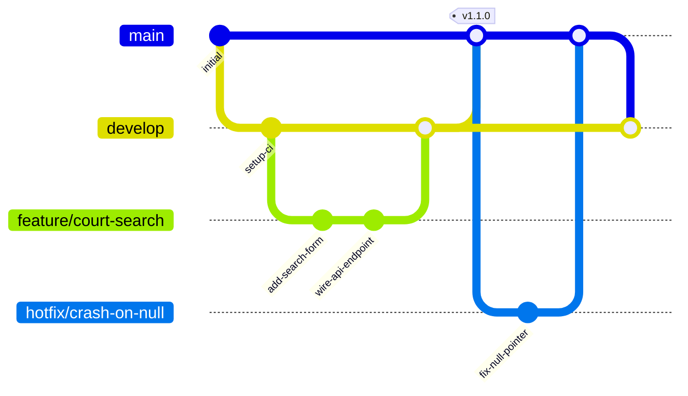

# ToopSet — Branch Strategy & Git Workflow

## Branch Model

```
main          ─── production (stable, deploy-ready)
develop       ─── staging / integration (next release)
feature/*     ─── new features (branch off develop → PR to develop)
fix/*         ─── bug fixes (branch off develop → PR to develop)
hotfix/*      ─── urgent production fixes (branch off main → PR to main + develop)
```

### Rules

| Branch      | Deploys to                | Protection |
|-------------|---------------------------|------------|
| `main`      | Vercel Production, Railway Production | 🔒 protected |
| `develop`   | Vercel Preview, Railway Staging      | 🔒 protected |
| `feature/*` | —                         | none       |
| `fix/*`     | —                         | none       |
| `hotfix/*`  | —                         | none       |

- **No direct pushes** to `main` or `develop`. All changes enter via Pull Request.
- Feature/fix branches branch off `develop` and merge back via PR.
- Hotfix branches branch off `main`, PR to `main`, then merge `main` back into `develop`.

## Workflow



### Daily workflow

```bash
git checkout develop
git pull origin develop
git checkout -b feature/my-feature

# ... work, commits ...

git push -u origin feature/my-feature
# → open PR: feature/my-feature → develop
```

### After PR merges to develop

- CI runs on `develop` (lint, typecheck, test, build).
- If CI passes → Vercel Preview deploy + Railway Staging deploy.
- QA on staging URL.

### Production release

```bash
git checkout main
git pull origin main
git merge develop
git push origin main
```

- CI runs on `main`.
- If CI passes → Vercel Production deploy + Railway Production deploy.
- Tag release: `git tag v1.1.0 && git push origin v1.1.0`

## Pull Request Checklist

- [ ] Branch from correct parent (`develop` for features/fixes, `main` for hotfixes)
- [ ] PR title follows conventional commits: `type(scope): description`
- [ ] Descriptive body explains what and why
- [ ] All CI checks pass (lint, typecheck, test, build)
- [ ] Lefthook pre-commit hooks pass locally
- [ ] Reviewed by at least one other person (when team grows)

## Recommended GitHub Branch Protection

### `main` branch

| Setting                          | Value                 |
|----------------------------------|-----------------------|
| Require pull request before merge | ✅ enabled            |
| Required approvals               | 1                     |
| Dismiss stale reviews             | ✅ enabled            |
| Require review from Code Owners   | ❌ (no CODEOWNERS yet)  |
| Require status checks             | ✅ enabled            |
|   — Frontend (lint + typecheck + build) | required        |
|   — Backend (lint + migration + test)   | required        |
| Require branches up to date        | ✅ enabled            |
| Require conversation resolution    | ✅ enabled            |
| Require signed commits             | ❌                    |
| Require linear history             | ❌                    |
| Include administrators             | ✅ enabled            |
| Allow force push                   | ❌                    |
| Allow deletions                    | ❌                    |

### `develop` branch

Same as `main`, except:

| Setting                          | Value                 |
|----------------------------------|-----------------------|
| Require branches up to date       | ❌ (optional — reduces friction) |

## CI Pipelines

| Trigger                        | Workflow            | Checks                                       |
|--------------------------------|---------------------|----------------------------------------------|
| PR to `main` or `develop`      | `ci.yml`            | Frontend: install → typecheck → lint → build |
|                                |                     | Backend: ruff → mypy → migration check → test|
| Push `develop`                 | `deploy-frontend`   | Vercel Preview deploy                        |
|                                | `deploy-backend`    | Railway Staging deploy                       |
| Push `main`                    | `deploy-frontend`   | Vercel Production deploy                     |
|                                | `deploy-backend`    | Railway Production deploy                    |

## Versioning

- `VERSION` file at repo root is single source of truth.
- Version follows semver: `MAJOR.MINOR.PATCH`.
- Tags match production releases: `v1.1.0`.
- Version bump happens **before** merging into `main`.
- `make version-check` verifies consistency across `VERSION`, `backend/app/__init__.py`, and `frontend/package.json`.
