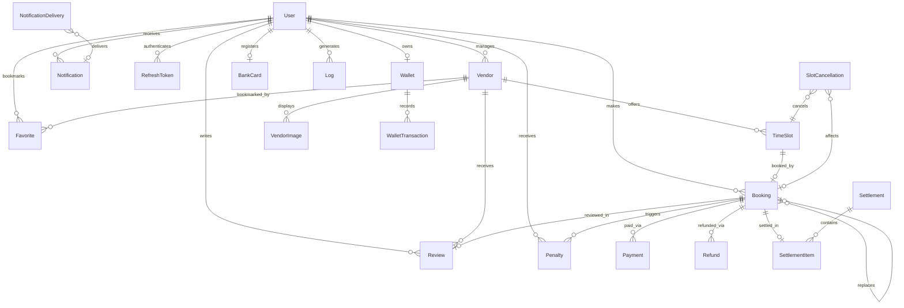

# Part 2B — Database Deep Dive

## Database Engine Setup

- **Engine:** `create_async_engine` with `asyncpg` driver
- **Pool:** `pool_size=20`, `max_overflow=10`, `pool_recycle=1800s`, `pool_timeout=5s`, `pool_pre_ping=True`
- **asyncpg tuning:** `statement_cache_size=0` (pgbouncer/transaction-pooling compatible), connect `timeout=5`
- **Session factory:** `async_sessionmaker(expire_on_commit=False)` — prevents detached-instance errors in async code
- **Query timing:** SQLAlchemy `before_cursor_execute`/`after_cursor_execute` events hook into the profiler; slow queries (>200ms) are logged

## Entity-Relationship Diagram



## All Models (Detailed)

### User (`users`)

The single account model for all roles (user, manager, admin).

| Column | Type | Nullable | Default | Purpose |
|---|---|---|---|---|
| `id` | Integer | — | PK auto | Primary key |
| `full_name` | String(128) | No | — | Display name |
| `phone` | String(16) | No | unique | Iranian mobile (09XXXXXXXXX) |
| `password_hash` | String(256) | No | — | bcrypt hash or `"__otp_user__"` |
| `role` | Enum(UserRole) | No | `"user"` | user / manager / admin |
| `avatar_url` | String(512) | Yes | — | Profile image path |
| `token_version` | Integer | No | `0` | JWT invalidation counter |
| `is_active` | Boolean | No | `True` | Account status |
| `created_at` | DateTime(tz) | No | `func.now()` | Registration timestamp |

**Constraints:**
- `CHECK (phone ~ '^09[0-9]{9}$')` — DB-level Iranian mobile format enforcement
- `ix_users_role`, `ix_users_created_at` — admin filtering/sorting

**Why `token_version`:** Incremented on login/password-change/admin-revoke. Access tokens embed this value; mismatch = instant invalidation of all prior tokens without maintaining a blacklist. Combined with `RefreshToken.revoked_at` for granular per-session control.

---

### Vendor (`vendors`)

A sports venue managed by a single manager user.

| Column | Type | Nullable | Default | Purpose |
|---|---|---|---|---|
| `id` | Integer | — | PK auto | — |
| `manager_id` | Integer | No | FK → users.id | Owner/manager |
| `name` | String(256) | No | — | Venue display name |
| `sport_types` | ARRAY(String) | No | `[]` | Multi-sport support |
| `address` | Text | No | — | Physical address |
| `latitude` / `longitude` | Float | No | — | Map coordinates |
| `capacity` | Integer | No | — | Max participants per slot |
| `amenities` | JSON | Yes | — | Flexible feature list |
| `is_active` | Boolean | No | `True` | Approved by admin |
| `average_rating` | Float | No | `0.0` | Denormalized from reviews |
| `created_at` | DateTime(tz) | No | `func.now()` | — |

**Relationships:** `time_slots`, `reviews`, `vendor_images` (all `cascade="all, delete-orphan"`), `favorites`

**Why `average_rating` is denormalized:** Prevents expensive `AVG()` joins on listing pages. Must be recalculated whenever reviews are created/updated/deleted.

**Why `sport_types` is ARRAY(String):** Migrated from single-value enum in migration `0003` to support multi-sport venues. No GIN index exists (potential optimization for `@>` containment queries).

---

### TimeSlot (`time_slots`)

A specific bookable time window — the core inventory unit.

| Column | Type | Nullable | Default | Purpose |
|---|---|---|---|---|
| `id` | Integer | — | PK auto | — |
| `vendor_id` | Integer | No | FK → vendors.id | Parent venue |
| `start_time` | DateTime(tz) | No | — | Stored in UTC |
| `end_time` | DateTime(tz) | No | — | Stored in UTC |
| `base_price` | Numeric(10,2) | No | — | Slot price (Toman) |
| `ball_price` | Numeric(10,2) | No | `0` | Optional ball rental |
| `ball_available` | Boolean | No | `False` | Whether ball option exists |
| `gender` | Enum(SlotGender) | No | `"male"` | Gender session type |
| `status` | Enum(SlotStatus) | No | `"open"` | 7-state lifecycle |
| `is_reserved` | Boolean | No | `False` | **Legacy** — superseded by status |
| `version` | Integer | No | `1` | Optimistic locking counter |

**Constraints:**
- `UniqueConstraint("vendor_id", "start_time", "end_time")` — prevents duplicate slot definitions
- `ix_time_slots_vendor_id_start_time` — core query: "slots for venue X on date Y"

**Slot Status Lifecycle:**
```
OPEN → RESERVING → RESERVED
  ↓                    ↓
BLOCKED            PENDING_CANCELLATION → OPEN (if replacement found)
  ↓
DISABLED / CLOSED
```

**Why `version` exists:** Classic optimistic locking. Booking creation includes `WHERE version = :expected`; concurrent booking attempts for the same slot — only one succeeds. Combined with the partial unique index on bookings for belt-and-suspenders double-booking prevention.

---

### Booking (`bookings`)

The central transactional entity — a reservation of a TimeSlot.

| Column | Type | Nullable | Default | Purpose |
|---|---|---|---|---|
| `id` | Integer | — | PK auto | — |
| `user_id` | Integer | No | FK → users.id | Booking owner |
| `slot_id` | Integer | No | FK → time_slots.id | Reserved slot |
| `replaces_booking_id` | Integer | Yes | FK → bookings.id (self) | Replacement chain |
| `status` | Enum(BookingStatus) | No | `"pending_payment"` | 6-state lifecycle |
| `source` | Enum(BookingSource) | No | `"online"` | online / manager_manual |
| `settlement_status` | Enum(SettlementStatus) | No | `"not_settled"` | Payout tracking |
| `created_by_manager_id` | Integer | Yes | FK → users.id | Walk-in creator |
| `customer_full_name` | String(128) | Yes | — | Walk-in customer name |
| `customer_phone` | String(16) | Yes | — | Walk-in customer phone |
| `price_paid` | Numeric(10,2) | No | — | Actual charge amount |
| `slot_price` | Numeric(10,2) | Yes | — | Snapshot of slot price at booking |
| `ball_price` | Numeric(10,2) | No | `0` | — |
| `with_ball` | Boolean | No | `False` | — |
| `penalty_amount` | Numeric(10,2) | Yes | — | Cancellation penalty if any |
| `participants_count` | SmallInteger | No | `1` | — |
| `created_at` / `updated_at` | DateTime(tz) | No | `func.now()` | — |
| `expires_at` | DateTime(tz) | Yes | — | 10-min payment window |

**Critical constraint:** `uq_bookings_one_active_per_slot` — partial unique index on `slot_id WHERE status IN ('pending_payment', 'confirmed', 'pending_cancellation')`. This is the **DB-level guarantee** against double-booking.

**Booking Status Lifecycle:**
```
PENDING_PAYMENT → CONFIRMED → PENDING_CANCELLATION → TRANSFERRED
       ↓              ↓
    EXPIRED        CANCELLED
```

---

### Payment (`payments`)

A payment gateway transaction attached to a booking.

| Column | Type | Nullable | Default | Purpose |
|---|---|---|---|---|
| `id` | Integer | — | PK auto | — |
| `booking_id` | Integer | No | FK → bookings.id | Multiple attempts allowed |
| `amount` | Numeric(10,2) | No | — | Charged amount |
| `gateway_transaction_id` | String(256) | Yes | — | Gateway reference |
| `gateway_name` | String(64) | Yes | — | e.g. "زرین‌پال" |
| `card_number` | String(32) | Yes | — | Masked card from gateway |
| `ref_id` | String(64) | Yes | — | Receipt number |
| `gateway_fee` | Numeric(10,2) | Yes | — | Gateway commission |
| `paid_at` | DateTime(tz) | Yes | — | Payment timestamp |
| `status` | Enum(PaymentStatus) | No | `"pending"` | pending/success/failed/expired |
| `created_at` | DateTime(tz) | No | `func.now()` | — |

---

### Refund (`refunds`)

Immutable financial snapshot of a refund case.

| Column | Type | Nullable | Default | Purpose |
|---|---|---|---|---|
| `id` | Integer | — | PK auto | — |
| `booking_id` | Integer | No | FK → bookings.id | — |
| `user_id` | Integer | No | FK → users.id | Refund recipient |
| `vendor_id` | Integer | No | FK → vendors.id | — |
| `slot_id` | Integer | No | FK → time_slots.id | — |
| `slot_start_time` / `slot_end_time` | DateTime(tz) | No | — | Snapshot copies |
| `original_amount` | Numeric(10,2) | No | — | What was originally paid |
| `slot_price` / `ball_price` / `total_paid` | Numeric(10,2) | No | — | Financial breakdown |
| `penalty_amount` | Numeric(10,2) | No | `0` | — |
| `refund_amount` | Numeric(10,2) | No | — | Net refund |
| `reason` | Text | No | — | — |
| `type` | Enum(RefundType) | No | — | user/manager/replacement cancellation |
| `status` | Enum(RefundStatus) | No | `"pending"` | pending/approved/rejected/paid |
| `penalty_charged_to_user` / `site_bears_penalty` | Boolean | No | — | Who absorbs penalty |
| `requested_at` / `approved_at` / `paid_at` | DateTime(tz) | Varies | — | Lifecycle timestamps |
| `admin_note` | Text | Yes | — | — |
| `payment_tracking_code` | String(128) | Yes | — | — |

**Constraint:** `UniqueConstraint("booking_id", "type")` — one refund per (booking, type).

**Why so many snapshot fields:** Preserves an immutable audit trail independent of later edits to the referenced booking/slot. Critical for financial compliance.

---

### RefreshToken (`refresh_tokens`)

Rotatable refresh tokens for JWT session management.

| Column | Type | Purpose |
|---|---|---|
| `id` | Integer | PK |
| `token_hash` | String(128), unique | SHA-256 of raw token — never stores plaintext |
| `user_id` | Integer, FK | Token owner |
| `session_id` | String(36) | Groups a device's token chain |
| `issued_at` / `expires_at` | DateTime(tz) | Lifecycle |
| `revoked_at` | DateTime(tz), nullable | NULL = still active |
| `replaced_by` | String(128), nullable | Hash of the replacement token |
| `device_info` / `ip_address` / `user_agent` | Strings | Audit trail |

**Indexes:** `(user_id, revoked_at)` for "active sessions", `(expires_at)` for GC, `(session_id)` for chain operations.

---

### Wallet (`wallets`) + WalletTransaction (`wallet_transactions`)

Internal credit balance system (refund credits).

- **Wallet:** 1:1 with User (enforced by unique `user_id`), stores `balance` as `Numeric(10,2)`
- **WalletTransaction:** Immutable ledger entries with `type` free-text (`deposit`, `withdrawal`, `refund`)

---

### Other Models

| Model | Table | Purpose |
|---|---|---|
| **BankCard** | `bank_cards` | Encrypted manager bank card for payouts, 1 per user |
| **Review** | `reviews` | User review (1:1 with booking via unique FK), manager can respond |
| **Penalty** | `penalties` | Monetary penalty records (late cancellation) |
| **Notification** | `notifications` | In-app notifications |
| **NotificationDelivery** | `notification_deliveries` | SMS/push delivery tracking with retry |
| **Settlement** + **SettlementItem** | `settlements`, `settlement_items` | Manager payout batches |
| **SlotCancellation** | `slot_cancellations` | Audit trail for manager-initiated slot cancellations |
| **ContactMessage** | `contact_messages` | "Contact Us" form (no FKs) |
| **Setting** | `settings` | Admin key-value config store |
| **Log** | `logs` | Structured audit log with correlation IDs |
| **VendorImage** | `vendor_images` | Ordered gallery images for venues |

---

## All Enums

| Enum | Values |
|---|---|
| **UserRole** | `user`, `manager`, `admin` |
| **BookingStatus** | `pending_payment`, `confirmed`, `pending_cancellation`, `transferred`, `cancelled`, `expired` |
| **BookingSource** | `online`, `manager_manual` |
| **SettlementStatus** | `not_settled`, `settlement_requested`, `included_in_settlement`, `settled`, `excluded_due_to_refund`, `excluded_due_to_cancellation` |
| **PaymentStatus** | `pending`, `success`, `failed`, `expired` |
| **SlotStatus** | `open`, `reserving`, `pending_cancellation`, `reserved`, `blocked`, `disabled`, `closed` |
| **SlotGender** | `male`, `female` |
| **BankCardStatus** | `pending_confirmation`, `verified`, `rejected` |
| **RefundStatus** | `pending`, `approved`, `rejected`, `paid` |
| **RefundType** | `user_cancellation`, `manager_cancellation`, `replaced_after_pending_cancellation` |
| **SettlementRequestStatus** | `pending`, `approved`, `rejected`, `paid` |
| **SportType** | `volleyball`, `basketball`, `futsal`, `handball`, `football` (app-level only, not DB enum) |

---

## Migration History Summary

| Migration | What Changed | Category |
|---|---|---|
| `0001` | Initial schema (users, courts, time_slots, bookings, payments, reviews, penalties, wallets, logs) | Foundation |
| `0002` | Add review.response + notifications table | Feature |
| `0003` | Single sport_type enum → sport_types array | Feature |
| `e0adc347178c` | Soft-delete columns, payment gateway fields, contact_messages, favorites | Feature |
| `0004` | Settings key-value table | Feature |
| `0005` | User.token_version for JWT invalidation | Security |
| `0006` | court_images normalized table | Feature |
| `0007` | **Remove** soft-delete columns (abandoned pattern) | Hardening |
| `0008` | User.avatar_url | Feature |
| `44f33e171792` | Swap email/phone nullability (phone = primary contact) | Hardening |
| `0009` | All datetimes → TIMESTAMPTZ (UTC normalization) | Hardening |
| `0010` | FK indexes for query performance | Performance |
| `0011` | Drop legacy court.images array column | Cleanup |
| `0012` | Additional performance indexes | Performance |
| `0013` | RefreshToken table + indexes | Security |
| `0014` | Log severity, request_id, IP, user_agent columns | Observability |
| `0015` | Slot status/gender enums, booking replaces/ball/version, bank_cards, drop 1:1 constraints | Feature + Hardening |
| `0016` | **Rename courts → vendors** (tables, FKs, indexes, sequences) | Rename |
| `0017` | Finance models (refunds, settlements, slot_cancellations, notification_deliveries), booking source/settlement_status, partial unique index `uq_bookings_one_active_per_slot` | Feature |
| `0018` | `CHECK (phone ~ '^09[0-9]{9}$')` on users | Hardening |
| `0019` | One bank card per user (dedup + constraint tightening) | Hardening |
| `0020` | Remove `manager_recurring` booking source (merged into `manager_manual`) | Simplification |

---

## Scalability Considerations

1. **Partial unique index** (`uq_bookings_one_active_per_slot`) is the most important constraint — guarantees no double-booking at the DB level regardless of application bugs
2. **Optimistic locking** (`TimeSlot.version`) provides application-level race protection complementing the DB constraint
3. **`is_reserved` legacy field** on TimeSlot is technical debt — duplicates information already in `status`. Should be dropped or derived as a property
4. **`Vendor.average_rating`** denormalization has no DB trigger — relies on application code to keep it consistent
5. **`sport_types` as ARRAY(String)** lacks a GIN index for efficient containment queries at scale
6. **No soft-delete** — relies on CASCADE deletes. No recovery path without DB backup
