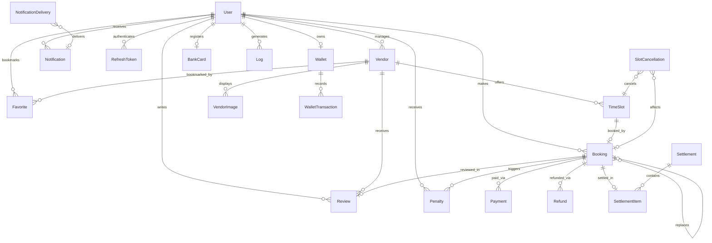

# بخش ۲ب — بررسی عمیق دیتابیس

## تنظیمات موتور دیتابیس

- **موتور:** `create_async_engine` با درایور `asyncpg`
- **پول:** `pool_size=20`، `max_overflow=10`، `pool_recycle=1800s`، `pool_timeout=5s`، `pool_pre_ping=True`
- **تنظیمات asyncpg:** `statement_cache_size=0` (سازگار با pgbouncer/transaction-pooling)، `timeout=5` برای اتصال
- **فکتوری نشست:** `async_sessionmaker(expire_on_commit=False)` — جلوگیری از خطاهای detached-instance در کد ناهمزمان
- **زمان‌سنجی کوئری:** رویدادهای `before_cursor_execute`/`after_cursor_execute` SQLAlchemy به پروفایلر متصل می‌شوند؛ کوئری‌های کند (>۲۰۰ms) لاگ می‌شوند

## نمودار موجودیت-رابطه



---

## تمام مدل‌ها (به‌تفصیل)

### User (`users`)

مدل حساب کاربری واحد برای تمام نقش‌ها (user، manager، admin).

| ستون | نوع | nullable | پیش‌فرض | کاربرد |
|---|---|---|---|---|
| `id` | Integer | — | PK auto | کلید اصلی |
| `full_name` | String(128) | خیر | — | نام نمایشی |
| `phone` | String(16) | خیر | unique | موبایل ایرانی (`۰۹XXXXXXXXX`) |
| `password_hash` | String(256) | خیر | — | هش bcrypt یا `"__otp_user__"` |
| `role` | Enum(UserRole) | خیر | `"user"` | user / manager / admin |
| `avatar_url` | String(512) | بله | — | مسیر تصویر پروفایل |
| `token_version` | Integer | خیر | `0` | شمارنده باطل‌سازی JWT |
| `is_active` | Boolean | خیر | `True` | وضعیت حساب |
| `created_at` | DateTime(tz) | خیر | `func.now()` | زمان ثبت‌نام |

**محدودیت‌ها:**
- `CHECK (phone ~ '^09[0-9]{9}$')` — اعمال فرمت موبایل ایرانی در سطح دیتابیس
- `ix_users_role`، `ix_users_created_at` — فیلتر/مرتب‌سازی ادمین

**چرا `token_version`:** با هر بار ورود/تغییر رمز/ابطال توسط ادمین افزایش می‌یابد. توکن‌های دسترسی این مقدار را در خود دارند؛ عدم تطابق = ابطال فوری تمام توکن‌های قبلی بدون نیاز به blacklist. همراه با `RefreshToken.revoked_at` برای کنترل granular در سطح نشست.

---

### Vendor (`vendors`)

مجموعه ورزشی که توسط یک کاربر manager مدیریت می‌شود.

| ستون | نوع | nullable | پیش‌فرض | کاربرد |
|---|---|---|---|---|
| `id` | Integer | — | PK auto | — |
| `manager_id` | Integer | خیر | FK → users.id | مالک/مدیر |
| `name` | String(256) | خیر | — | نام نمایشی مجموعه |
| `sport_types` | ARRAY(String) | خیر | `[]` | پشتیبانی چند ورزشی |
| `address` | Text | خیر | — | آدرس فیزیکی |
| `latitude` / `longitude` | Float | خیر | — | مختصات نقشه |
| `capacity` | Integer | خیر | — | حداکثر شرکت‌کننده هر سانس |
| `amenities` | JSON | بله | — | لیست امکانات (انعطاف‌پذیر) |
| `is_active` | Boolean | خیر | `True` | تأیید شده توسط ادمین |
| `average_rating` | Float | خیر | `0.0` | غیرنرمال شده از نظرات |
| `created_at` | DateTime(tz) | خیر | `func.now()` | — |

**روابط:** `time_slots`، `reviews`، `vendor_images` (همه `cascade="all, delete-orphan"`)، `favorites`

**چرا `average_rating` غیرنرمال شده:** از JOIN پرهزینه `AVG()` در صفحات لیست جلوگیری می‌کند. باید هر بار که نظری ایجاد/به‌روز/حذف می‌شود، دوباره محاسبه شود.

**چرا `sport_types` از نوع ARRAY(String):** از enum تک‌مقداری در مایگریشن `0003` به این فرمت تغییر یافته تا از مجموعه‌های چندورزشی پشتیبانی کند. ایندکس GIN وجود ندارد (بهینه‌سازی بالقوه برای کوئری‌های containment با `@>`).

---

### TimeSlot (`time_slots`)

یک بازه زمانی مشخص قابل رزرو — واحد موجودی اصلی.

| ستون | نوع | nullable | پیش‌فرض | کاربرد |
|---|---|---|---|---|
| `id` | Integer | — | PK auto | — |
| `vendor_id` | Integer | خیر | FK → vendors.id | مجموعه والد |
| `start_time` | DateTime(tz) | خیر | — | ذخیره شده به UTC |
| `end_time` | DateTime(tz) | خیر | — | ذخیره شده به UTC |
| `base_price` | Numeric(10,2) | خیر | — | قیمت سانس (تومان) |
| `ball_price` | Numeric(10,2) | خیر | `0` | اجاره توپ (اختیاری) |
| `ball_available` | Boolean | خیر | `False` | آیا گزینه توپ وجود دارد |
| `gender` | Enum(SlotGender) | خیر | `"male"` | نوع سانس جنسیتی |
| `status` | Enum(SlotStatus) | خیر | `"open"` | چرخه حیات ۷ حالته |
| `is_reserved` | Boolean | خیر | `False` | **قدیمی** — با status جایگزین شده |
| `version` | Integer | خیر | `1` | شمارنده قفل خوش‌بینانه |

**محدودیت‌ها:**
- `UniqueConstraint("vendor_id", "start_time", "end_time")` — جلوگیری از تعریف سانس تکراری
- `ix_time_slots_vendor_id_start_time` — کوئری اصلی: "سانس‌های مجموعه X در تاریخ Y"

**چرخه حیات وضعیت سانس:**
```
OPEN → RESERVING → RESERVED
  ↓                    ↓
BLOCKED            PENDING_CANCELLATION → OPEN (درصورت پیدا شدن جایگزین)
  ↓
DISABLED / CLOSED
```

**چرا `version` وجود دارد:** قفل خوش‌بینانه کلاسیک. ایجاد رزرو شامل `WHERE version = :expected` است؛ تلاش‌های همزمان برای یک سانس — فقط یکی موفق می‌شود. همراه با ایندکس partial unique روی bookings برای جلوگیری دوبل‌بوکینگ در دو سطح.

---

### Booking (`bookings`)

موجودیت تراکنشی مرکزی — رزرو یک TimeSlot.

| ستون | نوع | nullable | پیش‌فرض | کاربرد |
|---|---|---|---|---|
| `id` | Integer | — | PK auto | — |
| `user_id` | Integer | خیر | FK → users.id | مالک رزرو |
| `slot_id` | Integer | خیر | FK → time_slots.id | سانس رزرو شده |
| `replaces_booking_id` | Integer | بله | FK → bookings.id (خود) | زنجیره جایگزینی |
| `status` | Enum(BookingStatus) | خیر | `"pending_payment"` | چرخه حیات ۶ حالته |
| `source` | Enum(BookingSource) | خیر | `"online"` | online / manager_manual |
| `settlement_status` | Enum(SettlementStatus) | خیر | `"not_settled"` | پیگیری تسویه |
| `created_by_manager_id` | Integer | بله | FK → users.id | ایجادکننده حضوری |
| `customer_full_name` | String(128) | بله | — | نام مشتری حضوری |
| `customer_phone` | String(16) | بله | — | تلفن مشتری حضوری |
| `price_paid` | Numeric(10,2) | خیر | — | مبلغ واقعی شارژ شده |
| `slot_price` | Numeric(10,2) | بله | — | snapshot قیمت سانس موقع رزرو |
| `ball_price` | Numeric(10,2) | خیر | `0` | — |
| `with_ball` | Boolean | خیر | `False` | — |
| `penalty_amount` | Numeric(10,2) | بله | — | جریمه لغو (در صورت وجود) |
| `participants_count` | SmallInteger | خیر | `1` | — |
| `created_at` / `updated_at` | DateTime(tz) | خیر | `func.now()` | — |
| `expires_at` | DateTime(tz) | بله | — | مهلت پرداخت ۱۰ دقیقه |

**محدودیت بحرانی:** `uq_bookings_one_active_per_slot` — ایندکس partial unique روی `slot_id WHERE status IN ('pending_payment', 'confirmed', 'pending_cancellation')`. این **تضمین سطح دیتابیس** در برابر دوبل‌بوکینگ است.

**چرخه حیات وضعیت رزرو:**
```
PENDING_PAYMENT → CONFIRMED → PENDING_CANCELLATION → TRANSFERRED
       ↓              ↓
    EXPIRED        CANCELLED
```

---

### Payment (`payments`)

تراکنش درگاه پرداخت متصل به یک رزرو.

| ستون | نوع | nullable | پیش‌فرض | کاربرد |
|---|---|---|---|---|
| `id` | Integer | — | PK auto | — |
| `booking_id` | Integer | خیر | FK → bookings.id | تلاش‌های متعدد مجاز |
| `amount` | Numeric(10,2) | خیر | — | مبلغ شارژ شده |
| `gateway_transaction_id` | String(256) | بله | — | شناسه مرجع درگاه |
| `gateway_name` | String(64) | بله | — | مثلاً "زرین‌پال" |
| `card_number` | String(32) | بله | — | شماره کارت ماسک شده از درگاه |
| `ref_id` | String(64) | بله | — | شماره رسید |
| `gateway_fee` | Numeric(10,2) | بله | — | کارمزد درگاه |
| `paid_at` | DateTime(tz) | بله | — | زمان پرداخت |
| `status` | Enum(PaymentStatus) | خیر | `"pending"` | pending/success/failed/expired |
| `created_at` | DateTime(tz) | خیر | `func.now()` | — |

---

### Refund (`refunds`)

snapshot مالی غیرقابل تغییر از یک پرونده بازگشت وجه.

| ستون | نوع | nullable | پیش‌فرض | کاربرد |
|---|---|---|---|---|
| `id` | Integer | — | PK auto | — |
| `booking_id` | Integer | خیر | FK → bookings.id | — |
| `user_id` | Integer | خیر | FK → users.id | دریافت‌کننده بازگشت وجه |
| `vendor_id` | Integer | خیر | FK → vendors.id | — |
| `slot_id` | Integer | خیر | FK → time_slots.id | — |
| `slot_start_time` / `slot_end_time` | DateTime(tz) | خیر | — | کپی snapshot |
| `original_amount` | Numeric(10,2) | خیر | — | مبلغ اصلی پرداخت شده |
| `slot_price` / `ball_price` / `total_paid` | Numeric(10,2) | خیر | — | تفکیک مالی |
| `penalty_amount` | Numeric(10,2) | خیر | `0` | — |
| `refund_amount` | Numeric(10,2) | خیر | — | خالص بازگشت وجه |
| `reason` | Text | خیر | — | — |
| `type` | Enum(RefundType) | خیر | — | user/manager/replacement cancellation |
| `status` | Enum(RefundStatus) | خیر | `"pending"` | pending/approved/rejected/paid |
| `penalty_charged_to_user` / `site_bears_penalty` | Boolean | خیر | — | چه کسی جریمه را متحمل می‌شود |
| `requested_at` / `approved_at` / `paid_at` | DateTime(tz) | متغیر | — | زمان‌های چرخه حیات |
| `admin_note` | Text | بله | — | — |
| `payment_tracking_code` | String(128) | بله | — | — |

**محدودیت:** `UniqueConstraint("booking_id", "type")` — یک بازگشت وجه به ازای هر (booking, type).

**چرا این همه فیلد snapshot:** مسیر حسابرسی غیرقابل تغییر را مستقل از ویرایش‌های بعدی رزرو/سانس مربوطه حفظ می‌کند. برای انطباق مالی حیاتی است.

---

### RefreshToken (`refresh_tokens`)

توکن‌های refresh قابل چرخش برای مدیریت نشست JWT.

| ستون | نوع | کاربرد |
|---|---|---|
| `id` | Integer | PK |
| `token_hash` | String(128), unique | SHA-256 توکن خام — هرگز متن ساده ذخیره نمی‌شود |
| `user_id` | Integer, FK | مالک توکن |
| `session_id` | String(36) | گروه‌بندی زنجیره توکن یک دستگاه |
| `issued_at` / `expires_at` | DateTime(tz) | چرخه حیات |
| `revoked_at` | DateTime(tz), nullable | NULL = هنوز فعال |
| `replaced_by` | String(128), nullable | هش توکن جایگزین |
| `device_info` / `ip_address` / `user_agent` | رشته‌ها | مسیر حسابرسی |

**ایندکس‌ها:** `(user_id, revoked_at)` برای "نشست‌های فعال"، `(expires_at)` برای GC، `(session_id)` برای عملیات زنجیره‌ای.

---

### Wallet (`wallets`) + WalletTransaction (`wallet_transactions`)

سیستم موجودی اعتباری داخلی (اعتبار بازگشت وجه).

- **Wallet:** 1:1 با User (اجرا شده با unique `user_id`)، ذخیره `balance` از نوع `Numeric(10,2)`
- **WalletTransaction:** ورودی‌های دفتر کل غیرقابل تغییر با `type` متن آزاد (`deposit`، `withdrawal`، `refund`)

---

### سایر مدل‌ها

| مدل | جدول | کاربرد |
|---|---|---|
| **BankCard** | `bank_cards` | کارت بانکی رمزنگاری شده مدیر برای تسویه، ۱ عدد به ازای هر کاربر |
| **Review** | `reviews` | نظر کاربر (1:1 با booking از طریق unique FK)، مدیر می‌تواند پاسخ دهد |
| **Penalty** | `penalties` | ثبت جریمه نقدی (لغو دیرهنگام) |
| **Notification** | `notifications` | اعلان‌های درون‌برنامه‌ای |
| **NotificationDelivery** | `notification_deliveries` | پیگیری تحویل SMS/push با تلاش مجدد |
| **Settlement** + **SettlementItem** | `settlements`، `settlement_items` | دسته‌های پرداخت به مدیران |
| **SlotCancellation** | `slot_cancellations` | مسیر حسابرسی برای لغو سانس توسط مدیر |
| **ContactMessage** | `contact_messages` | فرم "تماس با ما" (بدون FK) |
| **Setting** | `settings` | فروشگاه کلید-مقدار پیکربندی ادمین |
| **Log** | `logs` | لاگ حسابرسی ساختاریافته با correlation ID |
| **VendorImage** | `vendor_images` | گالری تصاویر مرتب برای مجموعه‌ها |

---

## تمام Enumها

| Enum | مقادیر |
|---|---|
| **UserRole** | `user`، `manager`، `admin` |
| **BookingStatus** | `pending_payment`، `confirmed`، `pending_cancellation`، `transferred`، `cancelled`، `expired` |
| **BookingSource** | `online`، `manager_manual` |
| **SettlementStatus** | `not_settled`، `settlement_requested`، `included_in_settlement`، `settled`، `excluded_due_to_refund`، `excluded_due_to_cancellation` |
| **PaymentStatus** | `pending`، `success`، `failed`، `expired` |
| **SlotStatus** | `open`، `reserving`، `pending_cancellation`، `reserved`، `blocked`، `disabled`، `closed` |
| **SlotGender** | `male`، `female` |
| **BankCardStatus** | `pending_confirmation`، `verified`، `rejected` |
| **RefundStatus** | `pending`، `approved`، `rejected`، `paid` |
| **RefundType** | `user_cancellation`، `manager_cancellation`، `replaced_after_pending_cancellation` |
| **SettlementRequestStatus** | `pending`، `approved`، `rejected`، `paid` |
| **SportType** | `volleyball`، `basketball`، `futsal`، `handball`، `football` (فقط در سطح اپلیکیشن، نه enum دیتابیس) |

---

## خلاصه تاریخچه مایگریشن

| مایگریشن | تغییر | دسته‌بندی |
|---|---|---|
| `0001` | اسکیما اولیه (users, courts, time_slots, bookings, payments, reviews, penalties, wallets, logs) | پایه |
| `0002` | اضافه شدن review.response + جدول notifications | ویژگی |
| `0003` | sport_type تکی → sport_types آرایه | ویژگی |
| `e0adc347178c` | ستون‌های soft-delete، فیلدهای درگاه پرداخت، contact_messages، favorites | ویژگی |
| `0004` | جدول کلید-مقدار Settings | ویژگی |
| `0005` | User.token_version برای ابطال JWT | امنیت |
| `0006` | جدول نرمال‌سازی court_images | ویژگی |
| `0007` | **حذف** ستون‌های soft-delete (الگوی رها شده) | استحکام |
| `0008` | User.avatar_url | ویژگی |
| `44f33e171792` | تغییر nullability ایمیل/تلفن (تلفن = تماس اصلی) | استحکام |
| `0009` | تمام datetimeها → TIMESTAMPTZ (نرمال‌سازی UTC) | استحکام |
| `0010` | ایندکس FK برای کارایی کوئری | کارایی |
| `0011` | حذف ستون آرایه images قدیمی court | پاکسازی |
| `0012` | ایندکس‌های کارایی اضافی | کارایی |
| `0013` | جدول RefreshToken + ایندکس‌ها | امنیت |
| `0014` | ستون‌های severity، request_id، IP، user_agent در Log | مشاهده‌پذیری |
| `0015` | Enumهای slot status/gender، booking replaces/ball/version، bank_cards، حذف محدودیت‌های 1:1 | ویژگی + استحکام |
| `0016` | **تغییر نام courts → vendors** (جداول، FK، ایندکس‌ها، sequenceها) | تغییر نام |
| `0017` | مدل‌های مالی (refunds, settlements, slot_cancellations, notification_deliveries)، booking source/settlement_status، ایندکس partial unique `uq_bookings_one_active_per_slot` | ویژگی |
| `0018` | محدودیت `CHECK (phone ~ '^09[0-9]{9}$')` روی users | استحکام |
| `0019` | یک کارت بانکی به ازای هر کاربر (dedup + سفت‌کردن محدودیت) | استحکام |
| `0020` | حذف `manager_recurring` از booking source (ادغام در `manager_manual`) | ساده‌سازی |

---

## ملاحظات مقیاس‌پذیری

۱. **ایندکس partial unique** (`uq_bookings_one_active_per_slot`) مهم‌ترین محدودیت است — دوبل‌بوکینگ را در سطح دیتابیس تضمین می‌کند، فارغ از باگ‌های اپلیکیشن
۲. **قفل خوش‌بینانه** (`TimeSlot.version`) محافظ race condition در سطح اپلیکیشن را فراهم می‌کند و مکمل محدودیت دیتابیس است
۳. **فیلد قدیمی `is_reserved`** در TimeSlot بدهی فنی است — اطلاعاتی که قبلاً در `status` وجود دارد را تکرار می‌کند. باید حذف یا به عنوان property استخراج شود
۴. **غیرنرمال‌سازی `Vendor.average_rating`** تریگر دیتابیس ندارد — برای ثبات به کد اپلیکیشن متکی است
۵. **`sport_types` از نوع ARRAY(String)** فاقد ایندکس GIN برای کوئری‌های containment کارا در مقیاس بالا است
۶. **بدون soft-delete** — به CASCADE delete متکی است. بدون پشتیبان دیتابیس راه بازیابی وجود ندارد
